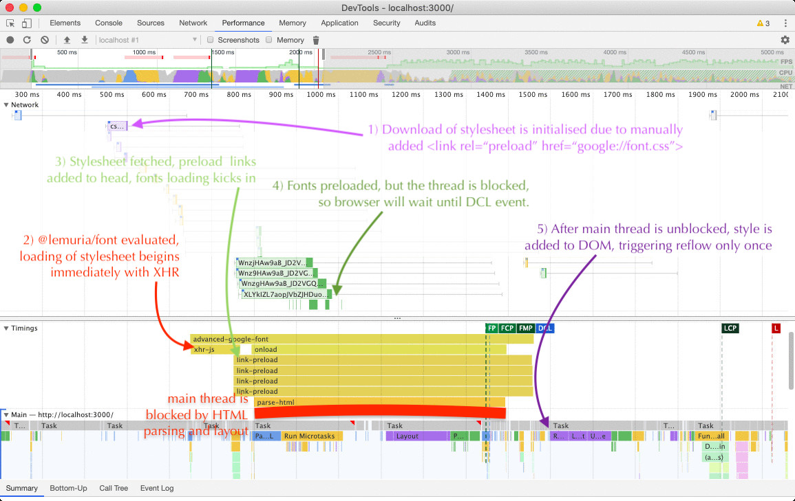

# @lemuria/font

[](https://npmjs.org/package/@lemuria/font)

`@lemuria/font` Loads A Web Font Stylesheet (e.g., _Google Fonts_) Without Render Blocking And Multiple Layout Updates.

The core function of this package should be placed in the `head` tag of the document where loading of the font is required. It will create an XHR request to the stylesheet, extract URLs of fonts referenced in it, add preload links to them, and only after each one of them has loaded, embed the stylesheet into the document. This allows to:

- Loads the stylesheet asynchronously without blocking the main thread.
- Prevents updating of layouts when a) stylesheet is loaded, b) each single font is loaded; and only updates the layout **once** when everything is ready.
- Allows to load the stylesheet faster than waiting for `onload` event when set on the link which has to await for the main thread unlike XHR, e.g.,
    ```html
    <!-- slower that @lemuria/font -->
    <link rel="preload"
      href="https://fonts.googleapis.com/css?display=swap&family=Gentium+Basic"
      crossorigin as="style" onload="this.rel='stylesheet';this.onload=null">
    ```



```sh
yarn add @lemuria/font
```

## Table Of Contents

- [Table Of Contents](#table-of-contents)
- [API](#api)
- [`font(url, defaultRanges=): void`](#fonturl-stringdefaultranges-object-void)
- [Copyright](#copyright)

<p align="center"><a href="#table-of-contents">
  
</a></p>

## API

The compiled function should be added first thing to the head:

```js
(function(){function v(g){var e=0;return function(){return e<g.length?{done:!1,value:g[e++]}:{done:!0}}}function w(g){var e="undefined"!=typeof Symbol&&Symbol.iterator&&g[Symbol.iterator];return e?e.call(g):{next:v(g)}};window["@lemuria/font"]=function(g,e){function q(b){b&&(performance.mark("link-preload-end"+b),performance.measure("link-preload","link-preload-start"+b,"link-preload-end"+b));r++;r>=n.length&&(b=document.createElement("style"),b.innerHTML=p,document.head.appendChild(b),performance.mark("agf-end"),performance.measure("@lemuria/font","agf-start","agf-end"))}function x(b,k,a){a=void 0===a?"":a;performance.mark("xhr-start"+a);var f=new XMLHttpRequest;f.onreadystatechange=function(){4==f.readyState&&
(200==f.status?(k(f.responseText),performance.mark("xhr-end"+a),performance.measure("xhr"+a,"xhr-start"+a,"xhr-end"+a)):console.error("Error loading webfont: server responded with code %s at %s",f.status,b))};f.open("GET",b);try{f.send(null)}catch(l){console.error(l)}}function y(b){for(var k=/url\((.+?)\).*?;\s+unicode-range: (.+?);/g,a={},f=[],l;l=k.exec(b);){var m=w(l);m.next();l=m.next().value;m=m.next().value;f.push({url:l,a:m});a[m]=1}a=Object.keys(a).reduce(function(c,d){var h=d.split(/,\s/).map(function(z){return z.replace("U+",
"\\u").replace("-","-\\u")}).join("").toLowerCase();c[d]=new RegExp("["+h+"]");return c},{});var t=document.body?document.body.innerText:"",A=t?Object.keys(a).reduce(function(c,d){a[d].test(t)&&(c[d]=!0);return c},{}):Object.keys(a).reduce(function(c,d){d in e&&(c[d]=!0);return c},{});n=f.filter(function(c){return c.a in A}).map(function(c){return c.url});if(!n.length)return q();var u=document.createDocumentFragment();n.forEach(function(c,d){var h=document.createElement("link");h.href=c;h.rel="preload";
h.as="font";performance.mark("link-preload-start"+d);h.onload=function(){return q(d)};h.setAttribute("crossorigin",!0);u.appendChild(h)});document.head.appendChild(u)}e=void 0===e?{}:e;performance.mark("agf-start");var p;(function(b,k){x(b.href,function(a){p=a;y(p)},"-"+(void 0===k?"link":k))})({href:g},"js");var n=[],r=0};}).call(this);

//# sourceMappingURL=font.js.map
```

Then it can be called:

```js
window['@lemuria/font']('https://fonts.googleapis.com/css?display=swap&family=Gentium+Basic')
```

`Display:swap` does not really matter, it is there to please _Lighthouse_.

There are additional elements to be added to the head for optimisation. Overall you get:

```html
<!doctype html>
<html>
  <head>
    <link rel="dns-prefetch" href="//fonts.googleapis.com">
    <link rel="preconnect" href="https://fonts.gstatic.com" crossOrigin>
    <link rel="preload" crossorigin as="fetch"
      href="https://fonts.googleapis.com/css?display=swap&family=Gentium+Basic">
    <script>
      // <@lemuria/font copy-paste source>
      window['@lemuria/font']
        ('https://fonts.googleapis.com/css?display=swap&family=Gentium+Basic')
    </script>
    <link rel="stylesheet" href="style.css">
  </head>
  <body>
    <h1> Summertime </h1>
    <p> and the livin's easy </p>
  </body>
</html>
```

If a function needs to be added on the server for SSR, it can be imported via the default export (see the SSR example below):

```js
import font from '@lemuria/font'
```

<p align="center"><a href="#table-of-contents">
  
</a></p>

## <code><ins>font</ins>(</code><sub><br/>&nbsp;&nbsp;`url: string,`<br/>&nbsp;&nbsp;`defaultRanges=: Object,`<br/></sub><code>): <i>void</i></code>
 - <kbd><strong>url*</strong></kbd> <em>`string`</em>: The full url of the web-font to load, e.g.,
`https://fonts.googleapis.com/css?display=swap&family=Limelight`.
 - <kbd>defaultRanges</kbd> <em>`Object`</em> (optional): When the stylesheet was loaded before body was parsed, there's no way for the script to know which fonts to load based on `unicode-range` property of the `@font-face`. By passing an object with ranges, only specific fonts will be preloaded. Must be an object in the following format (taken directly from the stylesheet):
```js
{
  'U+0000-00FF, U+0131, U+2191, U+2193, U+2212, U+2215, U+FEFF, U+FFFD': true
}
```

```jsx
import font, {
  debug as fontDebug, // unminified version
} from '@lemuria/font'
import idio from '@idio/idio'
import render from '@depack/render'

(async () => {
  const FONT = 'Gentium+Basic:400,400i,700|Limelight'
  const URL = `https://fonts.googleapis.com/css?display=swap&family=${FONT}`

  const { app, url } = await idio({
    async render(ctx) {
      ctx.body = render(<html>
        <head>
          <link rel="dns-prefetch" href="//fonts.googleapis.com"/>
          <link rel="preconnect" href="https://fonts.gstatic.com" crossOrigin/>
          <link rel="preload" href={URL} crossOrigin as="fetch"/>
          <script dangerouslySetInnerHTML={{ __html:
            `(${font.toString()})('${URL}')` }}/>
          <style>
            {`h1 { font-family: 'Limelight', cursive }
              p { font-family: 'Gentium Basic', serif }
            `}
          </style>
        </head>
        <body>
          <h1>Hello World</h1>
          <p>Example text.</p>
        </body>
      </html>, { addDoctype: true })
    },
  })
  console.log(url)
})()
```

<p align="center"><a href="#table-of-contents">
  
</a></p>

## Copyright

<table>
  <tr>
    <th>
      <a href="https://artd.eco">
        
      </a>
    </th>
    <th>© <a href="https://artd.eco">Art Deco</a>   2019</th>
    <th>
      <a href="https://www.technation.sucks" title="Tech Nation Visa">
        
      </a>
    </th>
    <th><a href="https://www.technation.sucks">Tech Nation Visa Sucks</a></th>
  </tr>
</table>

<p align="center"><a href="#table-of-contents">
  
</a></p>